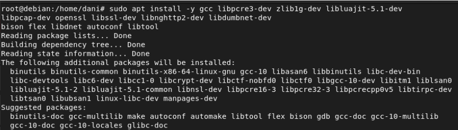
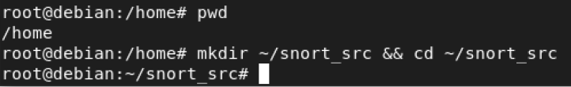
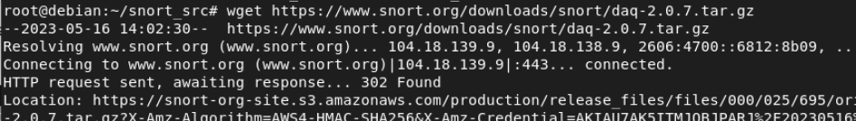
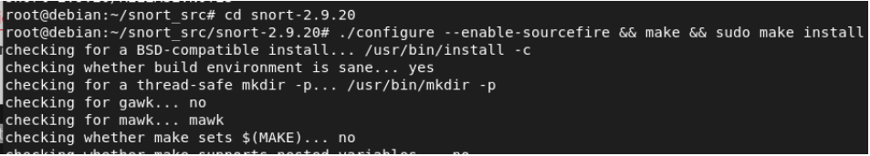
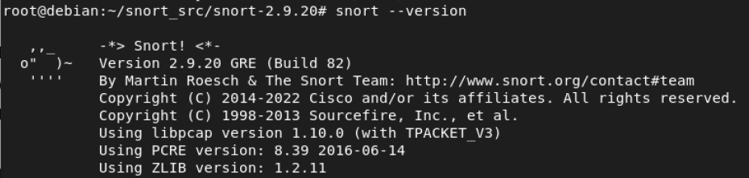

# Snort


## What is SNORT?  

In simple words, SNORT is like a digital security guard for computer networks. Imagine it as a superhero that watches over your network, looking for bad guys trying to break in or cause trouble.

## What is it used for?

Some things that <b>SNORT</b> does:

Detecting Intruders: Snort's main job is to spot suspicious activities happening in your network. It pays attention to the data passing through your network, just like a guard keeps an eye on people entering a building.

Rules and Patterns: Snort uses a set of rules, like a secret codebook. These rules describe the behavior of known digital bad guys. When Snort sees something matching these rules, it raises a red flag.

Alerts: When Snort finds something fishy, it doesn't just keep it to itself. It sends out an alert, like sounding an alarm. This alert tells your network administrators that something might be wrong.

Protection: Snort can also step in and block suspicious traffic, just like a bouncer at a club who refuses entry to troublemakers. This is called Intrusion Prevention.

Updates: Snort isn't static. It's regularly updated with new rules to recognize the latest threats. It's like giving your security guard new information about the bad guys in town.

Use Cases: Snort is used in all sorts of places, from big companies to small homes. It helps protect networks from cyberattacks, like viruses and hackers, and ensures that digital information stays safe.

## How does SNORT work?  

Snort works by analyzing network traffic in real-time to detect suspicious or malicious activity. Here's a simplified explanation of how it works:

- Packet Capture: Snort starts by capturing network packets. Think of these packets as small pieces of data that travel over the internet, like letters in the mail.

- Preprocessing: Before analyzing packets, Snort might preprocess them. This means cleaning them up and preparing them for inspection.

- Rule Matching: Snort uses a set of rules, also known as signatures, to identify known patterns of malicious activity. These rules describe what specific threats look like. For example, a rule might say, "If a packet contains the word 'virus,' consider it suspicious."

- Packet Analysis: Snort examines each packet and compares its contents to the rules. If it finds a match, it triggers an alert. It's like Snort's way of saying, "Hey, I found something strange here!"

- Logging and Alerting: When Snort detects a suspicious packet, it can log information about it and generate an alert. This alert can be sent to a security administrator or a monitoring system.

- Decision and Action (optional): Depending on how Snort is configured, it can take actions beyond just alerting. For example, it can block the suspicious traffic to prevent it from causing harm. This is known as Intrusion Prevention.

- Continual Monitoring: Snort keeps monitoring network traffic continuously, so it's always on the lookout for potential threats.

A simple analogy on how SNORT works would be: imagine Snort as a security guard at a gate (your network). The guard has a list of known troublemakers (the rules), and they check everyone's belongings (network packets) as they enter. If they find anything suspicious (a match with the rules), they sound an alarm (generate an alert) or even block the troublemaker from entering (Intrusion Prevention).

Snort's strength lies in its ability to quickly and efficiently analyze a massive amount of network data, helping organizations identify and respond to potential security threats in real-time.

## Let's see an example

I installed SNORT on a Virtual Machine using a Ubuntu Distribution.

1) Necessary libraries:



```
sudo apt install -y gcc libpcre3-dev zlib1g-dev libluajit-5.1-dev libpcap-dev openssl libssl-dev libnghttp2-dev libdumbnet-dev
bison flex libdnet autoconf libtool
```
Once done this, I proceed to install <b>SNORT</b> in a temporary directory under the HOME folder.



2) Installing DAQ:
   
Snort uses something called DAQ to make abstract calls to packet capture libraries. To install DAQ I followed the steps explained on [UPCLOUD](https://upcloud.com/resources/tutorials/installing-snort-on-debian).  



- Unzip and enter the downloaded folder:
```
tar -xvzf daq-2.0.7.tar.gz
cd daq-2.0.7
```
- Run the autoreconf command (it gave me an error as I had it not installed). Installed it with:
```
sudo apt-get install autoconf
```
- Configure script and compile the program with: 
```
$ ./configure && make && sudo
make install
```
3) Installing snort:

Installing snort from source:
```
$ wget https://www.snort.org/downloads/snort/snort-2.9.20.tar.gz
```
Extract and enter the new directory:

```
tar -xvzf snort-2.9.16.tar.gz
cd snort-2.9.16
```

Set up the instalation:

```
$ ./configure --enable-sourcefire && make && sudo make install
```


Let's check if all was installed correctly:

```
snort --version
```



It is !! :sunglasses:

Now let's config some rules!! 😄

In this case a simple one which will detect a PING from the host to the virtual machine I have as a lab environment.
